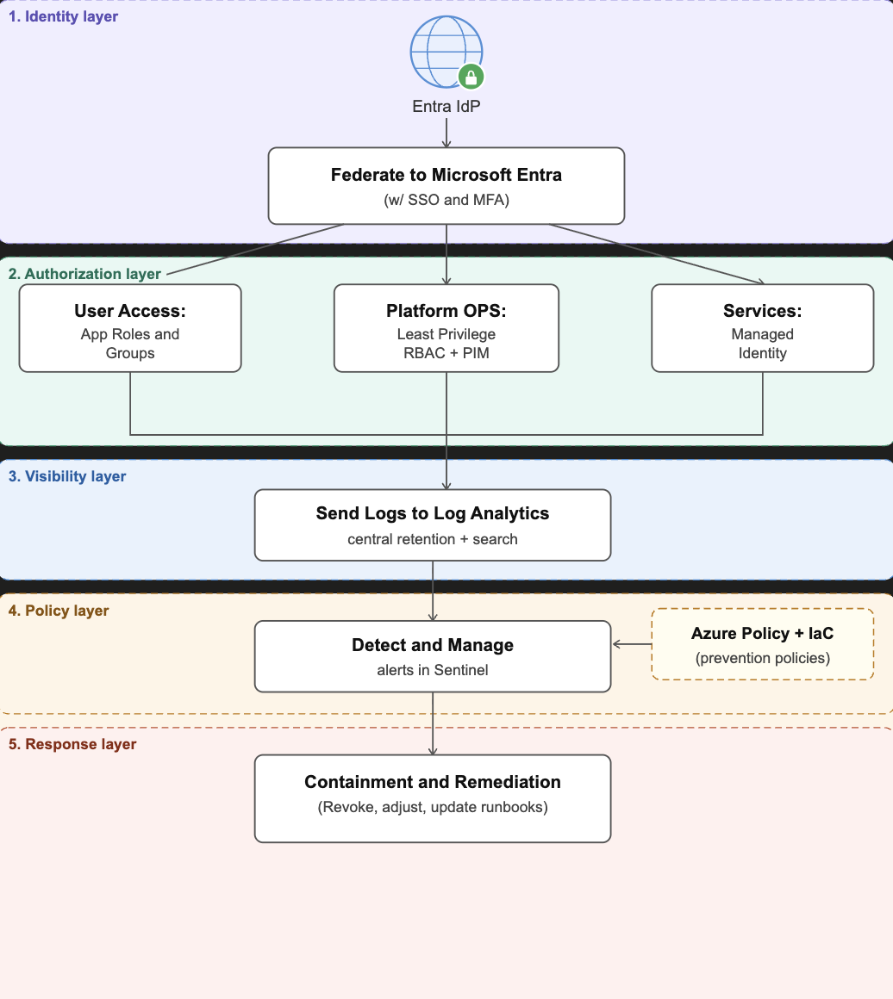

A10: Secure Infrastructure Proposal

Scenario: A mid-sized SaaS company expanding into the education market on Microsoft Azure.
The company currently has a basic cloud setup with minimal security. It needs to support enterprise SSO, least-privilege access, audit log retention, compliance readiness, and a weekly deployment cadence.

Part A - Architecture Diagram
I chose to stay on Microsoft Azure so that identity, logging, policy, and detection are all in one stack and easier to explain to an auditor.
The diagram below shows the full security flow from login to incident response.

How to read the flow

| Step | Meaning |
| --- | --- |
| Users log in | Schools and organizations use their existing accounts via SSO. All logins go through Entra ID. |
| Identity check | Entra ID confirms who the user is and enforces MFA. Conditional Access policies block risky sign-ins. |
| Access control | RBAC roles decide what each user can see or do. Admins use PIM for temporary elevated access only. |
| App + resources | Services authenticate using managed identities so there are no hardcoded passwords in code. |
| All activity is logged | Every action from every service lands in Log Analytics - one central place for audit and search. |
| Policy + IaC | Azure Policy and Terraform templates prevent misconfigs before and after deployment. |
| Alerts fire | Sentinel monitors the logs and fires alerts when something looks suspicious. |
| Contain + fix | Sessions are revoked, IPs are blocked, runbooks are updated to prevent it from happening again. |

## Part B - Compliance Mapping Table

| Requirement | What we do | Tool | Proof for auditor |
| --- | --- | --- | --- |
| Only authorized users can log in | SSO + MFA enforced for every login | Azure Entra ID | Sign-in logs, MFA registration report |
| Admins are tracked and accountable | Named admin accounts only, temporary access that expires | Entra PIM | Elevation logs with user + timestamp |
| All activity is recorded | Every log from every service goes to one central place | Log Analytics | Retention settings, sample log export |
| Suspicious activity is caught | Alerts trigger when something looks wrong (unusual location, failed logins, etc.) | Microsoft Sentinel | Alert rule list, incident history |
| Bad configs are blocked before deploy | Policy rules and IaC templates enforced in the pipeline | Azure Policy + Terraform | Policy compliance report, failed pipeline example |

## Part C - Incident Response Outline

**Scenario:** A user account successfully logs in from a country the account has never accessed from before, outside of business hours.

| Phase | What happens |
| --- | --- |
| **Detection** | Sentinel fires an alert from a KQL rule that flags a successful login from an unusual location combined with an atypical sign-in time. The on-call person gets notified through the normal alerting path. |
| **Evidence** | Pull the sign-in logs from Entra ID (IP address, location, device, MFA status), the audit logs showing what the user accessed after logging in, and the Sentinel incident record. Save copies to immutable storage in case it needs legal or customer review. |
| **Containment** | Immediately revoke all active sessions for that account. Disable the account in Entra ID temporarily. Block the suspicious IP at the network edge. Notify the account owner to verify if it was them. |
| **Remediation** | Add a Conditional Access named location policy to block logins from non-approved countries. Require the user to re-verify their identity and re-enroll MFA before re-enabling the account. Update the KQL detection rule if it was too slow to catch it. Document the incident in the runbook. |

## Key Design Decisions and Tradeoffs

1. **One stack on Azure** - keeps logging, identity, policy, and detection together, which makes pulling audit evidence much easier. The tradeoff is vendor lock-in and rising log storage costs as the company grows.

2. **Federation for education customers** - schools already have their own identity systems. Integrating with them instead of forcing new accounts reduces friction and builds customer trust.

3. **Preventive and detective controls** - Azure Policy and Terraform catch mistakes before they hit production. Sentinel catches what still slips through. Weekly releases work because automated checks replace manual approval gates.

4. **Managed identities for services** - eliminates credential leaks from hardcoded secrets. The tradeoff is that you need clear documentation of which service is allowed to access what.

## Reflection

The main tradeoff in this design is choosing auditability and security over low cost and maximum speed. Centralizing everything on Azure, enforcing strong identity controls, and retaining logs all add cost but they make compliance reviews much more manageable.

To keep the weekly release cadence realistic, I leaned on automation Terraform pipelines, Azure Policy, and Sentinel playbooks instead of manual review gates on every deploy. Some risk is accepted and handled through detection and response rather than blocking every single change.

**With more time and budget I would add:**

- Customer-managed encryption keys for the most sensitive tenants
- A formal SOC 2 or FERPA compliance mapping on top of this design
- Regular tabletop incident exercises to test the IR runbooks
- External penetration testing on a scheduled cadence
- Deeper data governance controls specific to student data